<!-- Main -->

<!-- One -->
<section id="one">
	

		<header class="major">
			<h1>Creative Technologist</h1>
		</header>

<!-- Content -->
<!-- <h2 id="content">The What</h2> -->

 I use contemporary technologies to create audio-visual experiences focussing on  <b> Interactivity </b> and <b> Autonomy </b>.

	

		<h2 class="align-center">Interactivity</h2>
		

		<ul>
			<li>Systems driven by a sense of immediacy</li>
			<li>Hardware development for physical interaction</li>
			<li>Networked interaction through the Web</li>
		</ul>
		

	

	

		<h2 class="align-center">Autonomy</h2>
		

		<ul>
			<li>Systems exploring stochastic <i> processes </i> </li>
			<li>Producing complexity out of simple rule-sets</li>
			<li>Growth and evolution</li>
		</ul>
		

	

I explore the domains of:
<li> <strong> Audio-Visual Installations  </strong>
<li> <strong>Audio-Visual Pieces </strong>
<li> <strong> Interface Design and Development </strong>
 
 
Some of my recent projects are listed <i> below.</i>

	<h4>Red Bull Music Academy: Diggin' in the Carts</h4>
		<i>Audio Reactive CRT Installation at Fabric, London 2017.</i>
		

		 
		
 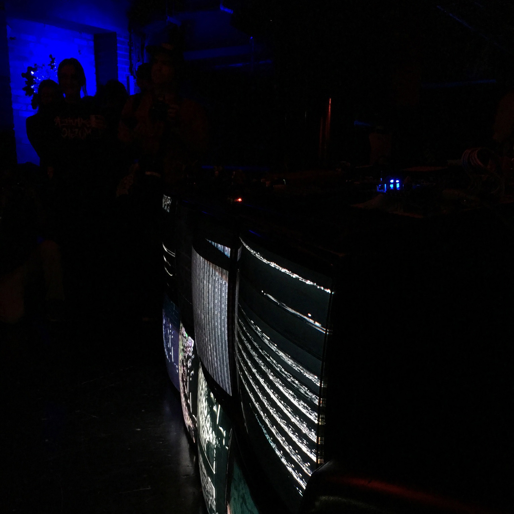 

		
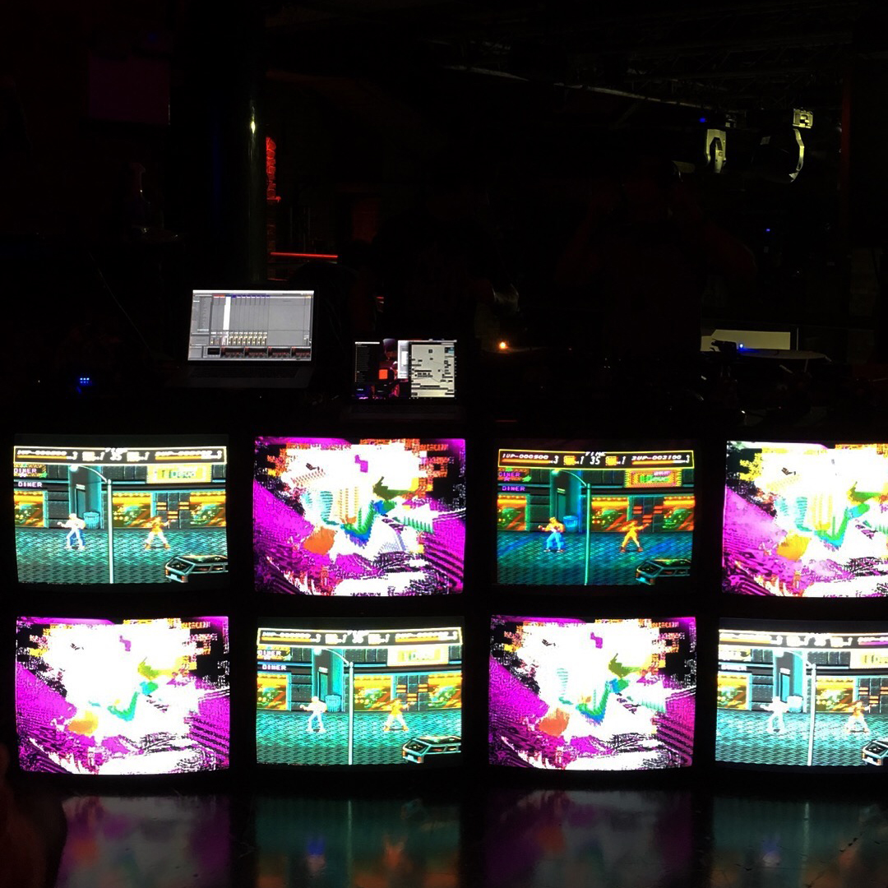 

		
 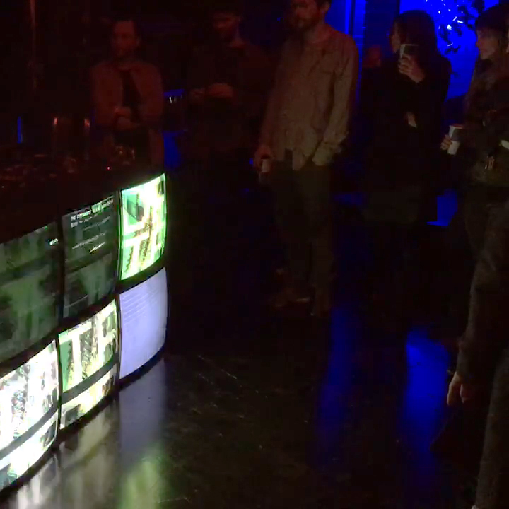 

		

		 

		<h4>Aesthesis</h4>
			<i>Networked audio-visual site-specific installation exploring relationships between space, time and audience interaction. London 2017.</i>
			

			 
			
 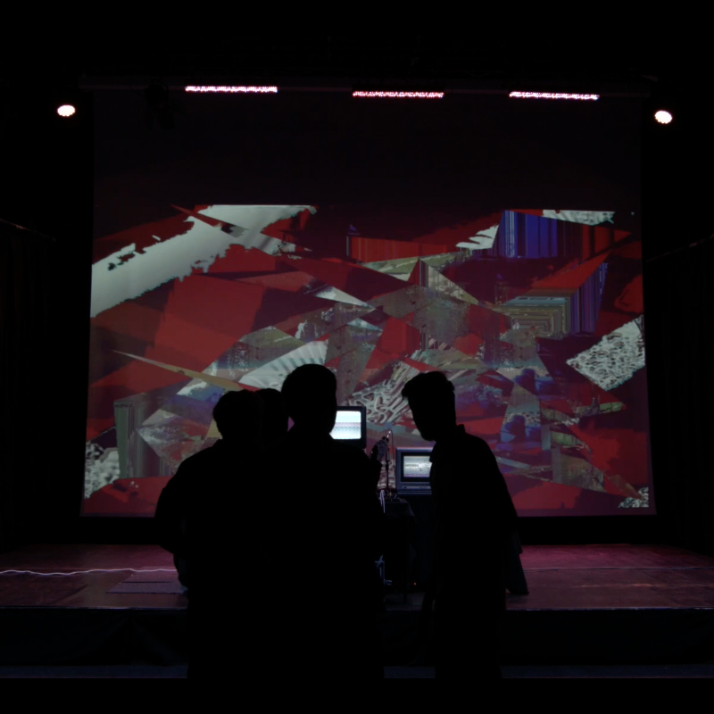 

			
  

			
 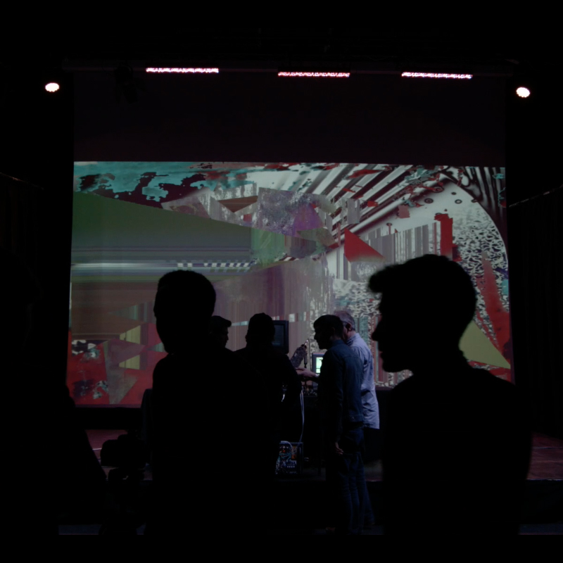 

			

<h4>Shakespeare <i> in 5.1 </i> </h4>
			<i>An interactive performance piece featuring voice actors, acoustic instruments & synthesizers; manipulated by a live audience through the web-browser. London 2017.</i>
			

			 
			
 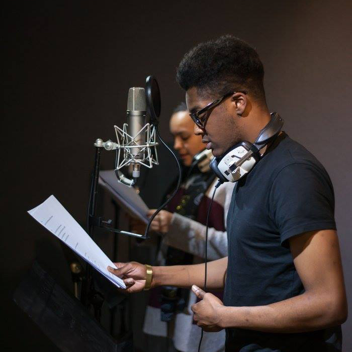 

			
 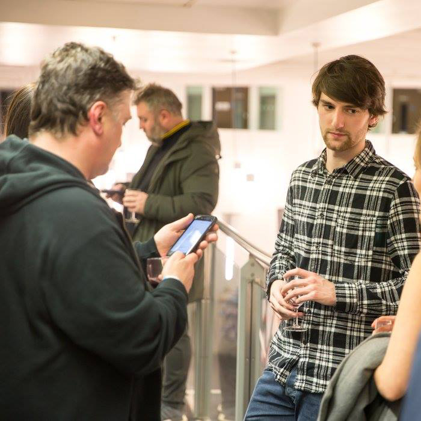 

			
 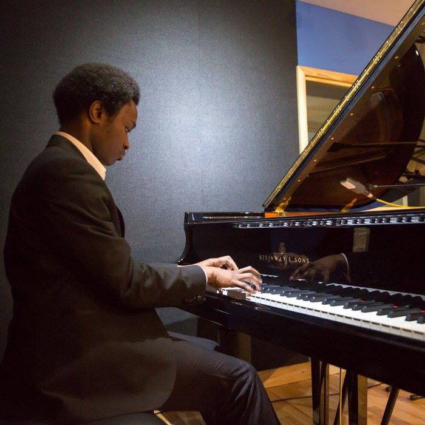 

			
 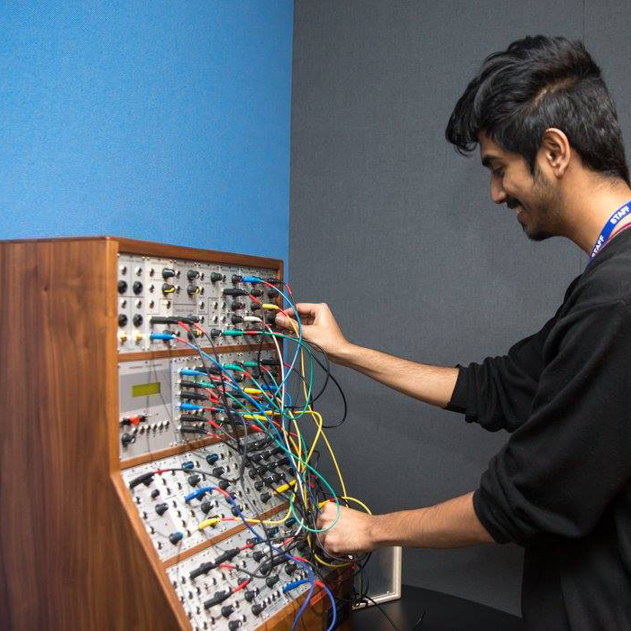 

			

<h4>Systems</h4>
			<i> A study in generative composition. Autonomous systems based on pioneering works of Craig Reynolds are modelled using contemporary web technologies and the data is sonified, using real-time synthesis algorithms designed in the Kyma Sound Design Environment. </i>
			

			 
			
 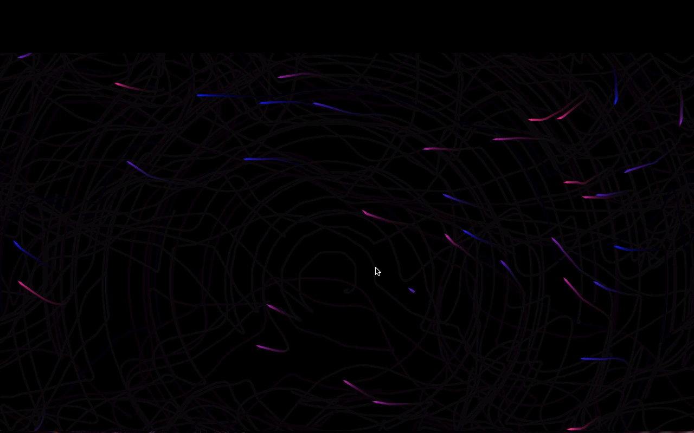 

			
 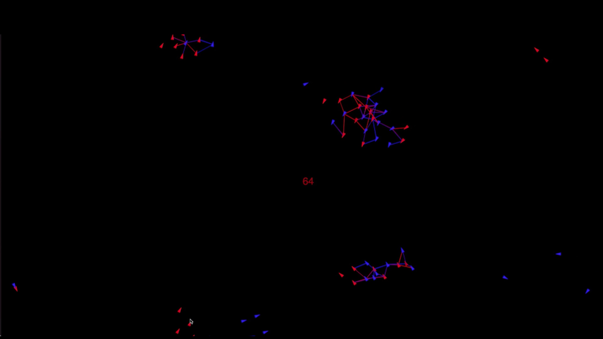 

			
 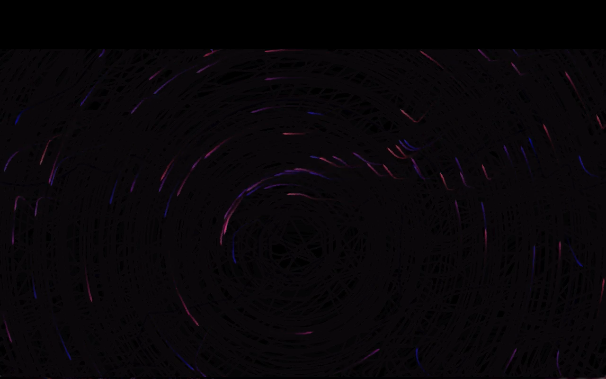 

			

