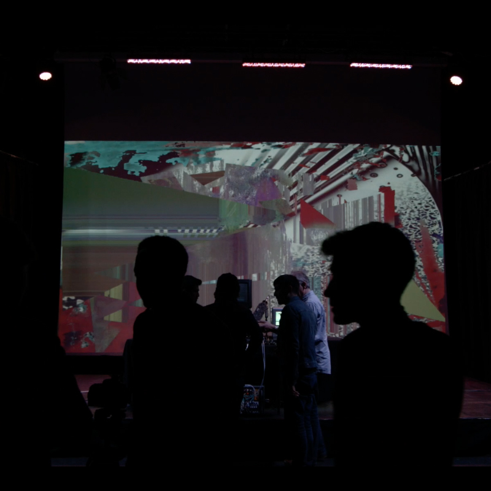
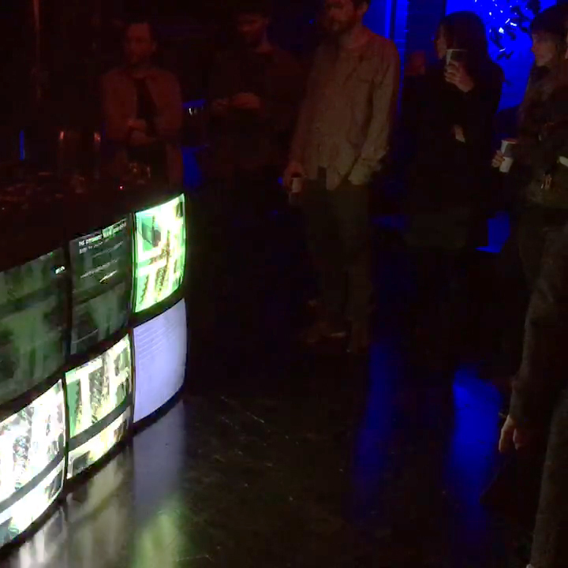
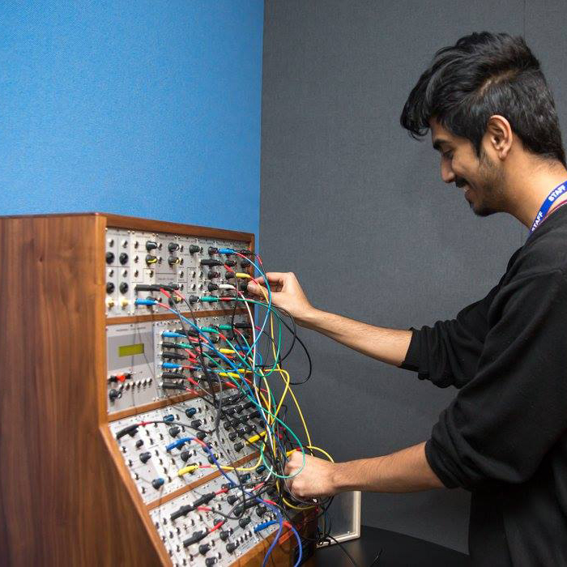
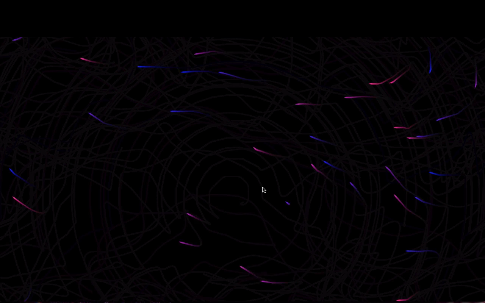
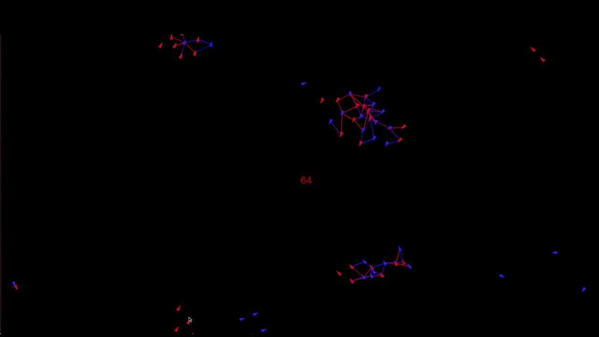
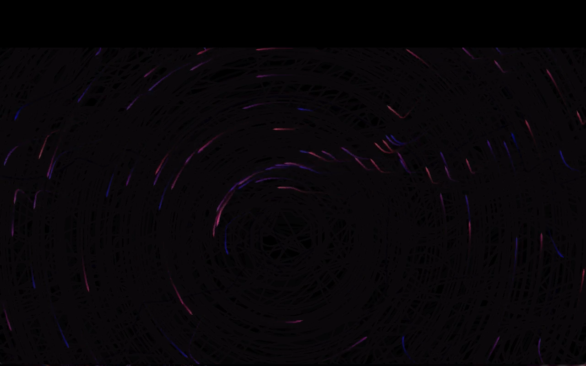

<!-- Main -->

<!-- One -->
<section id="one">
	

		<header class="major">
			<h1>Creative Technologist</h1>
		</header>

<!-- Content -->
<!-- <h2 id="content">The What</h2> -->

I create  interfaces for artistic expression across sonic and visual mediums.
 I conceptualise, design and execute projects involving bespoke hardware and software solutions. My work involves creating visceral experiences focussing on  <b> Interactivity </b> and <b> Immediacy </b>.
I explore the domains of:
<li> <strong> Interactive Audio-Visual Installations  </strong>
<li> <strong> Interactive Augmented/Mixed Reality Pieces </strong>
<li> <strong> Physical Interfaces for Sound & Video Synthesis </strong>
 
Some of my recent projects are listed <i> below.</i>

<h4>AR Filters for Instagram</h4>
	<i>Interactive augmented reality filters for Instagram and Facebook paying homage to the idiosyncracies of analog video synthesis.</i>
	

	 
	
  

	
  

	
  

	

<h4>Aesthesis</h4>
	<i>Networked audio-visual site-specific installation exploring relationships between space, time and audience interaction. London 2017.</i>
	

	 
	
  

	
  

	
  

	

	<h4>Red Bull Music Academy: Diggin' in the Carts</h4>
		<i>Audio Reactive CRT Installation at Fabric, London 2017.</i>
		

		 
		
  

		
 

		
  

		

		 

<h4>Shakespeare <i> in 5.1 </i> </h4>
			<i>An interactive performance piece featuring networked audio, voice actors, acoustic instruments & synthesizers; manipulated by a live audience through mobile web-browsers. London 2017.</i>
			

			 
			
  

			
  

			
  

			
  

			

<h4>Systems</h4>
			<i> A study in generative composition. Autonomous systems based on pioneering works of Craig Reynolds are modelled using contemporary web technologies and the data is sonified, using real-time synthesis algorithms designed in the Kyma Sound Design Environment. </i>
			

			 
			
  

			
  

			
  

			

<h4>Voltage Controlled Video Matrix </h4>
			<i> A study in physical computing. Banks of high-speed relays glitches 8 x 8 composite video. Can also be used as an 8 Voice Polyphonic Synthesizer at audio, <b> and video </b> rates. </i>
			

			 
			
  

			
  

			

<footer id="footer">
		

			<ul class="icons">
				
				<li><a href="{{ site.twitter_url }}" class="icon alt fa-twitter" target="_blank">Twitter</a></li>
				
				
				<li><a href="{{ site.googleplus_url }}" class="icon alt fa-google-plus" target="_blank">Google+</a></li>
				
				
				<li><a href="{{ site.facebook_url }}" class="icon alt fa-facebook" target="_blank">Facebook</a></li>
				
				
				<li><a href="{{ site.instagram_url }}" class="icon alt fa-instagram" target="_blank">Instagram</a></li>
				
				
				<li><a href="{{ site.pinterest_url }}" class="icon alt fa-pinterest" target="_blank">Pinterest</a></li>
				
				
				<li><a href="{{ site.gitlab_url }}" class="icon alt fa-gitlab" target="_blank">GitLab</a></li>
				
				
				<li><a href="{{ site.github_url }}" class="icon alt fa-github" target="_blank">GitHub</a></li>
				
				
				<li><a href="{{ site.slack_url }}" class="icon alt fa-slack" target="_blank">Slack</a></li>
				
				
				<li><a href="{{ site.linkedin_url }}" class="icon alt fa-linkedin" target="_blank">LinkedIn</a></li>
				
			</ul>
			<ul class="copyright">
				<li>&copy; {{ site.title }} {{ site.subtitle }}</li>

			</ul>
		

	</footer>