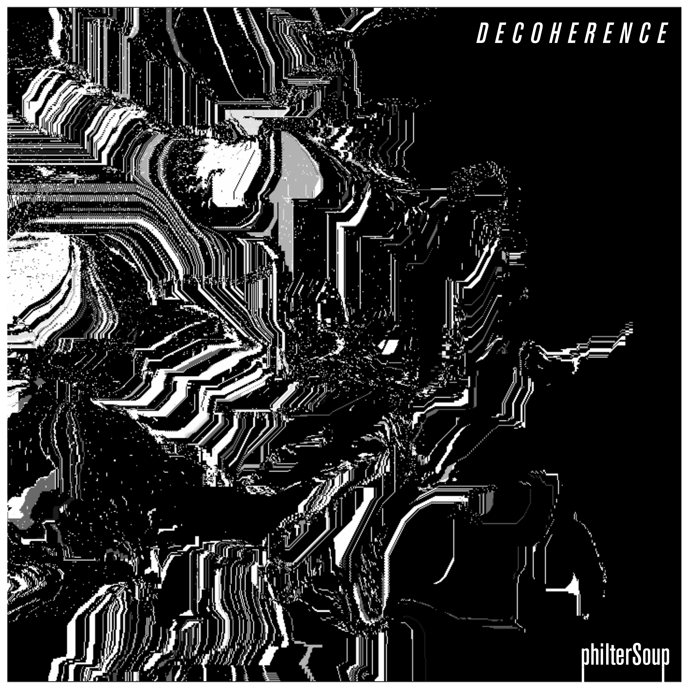
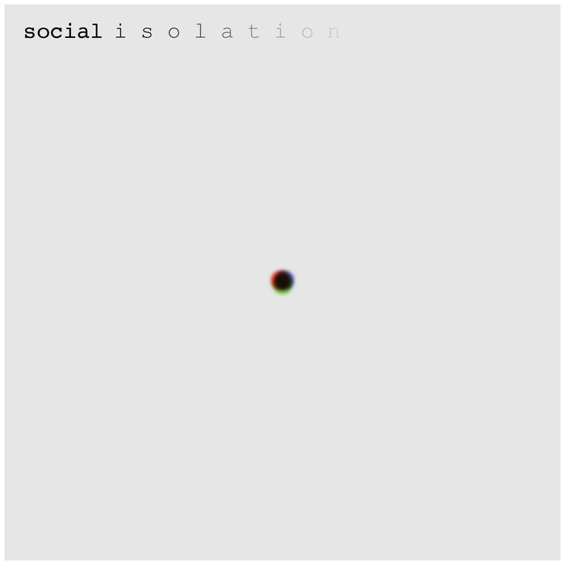
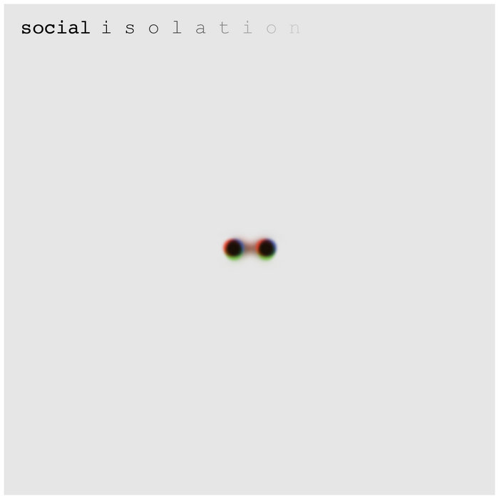
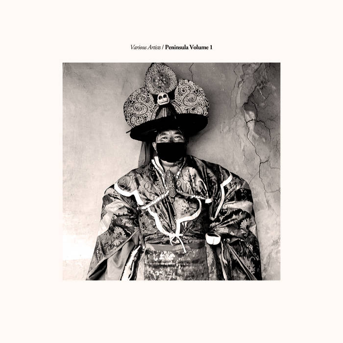
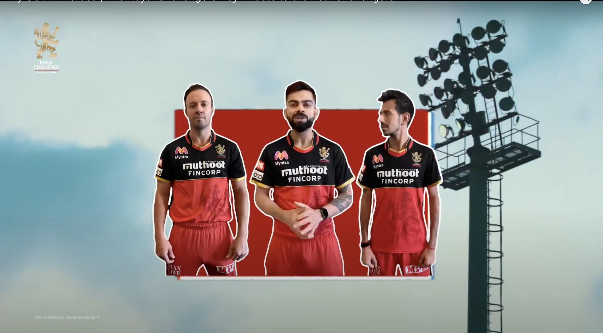
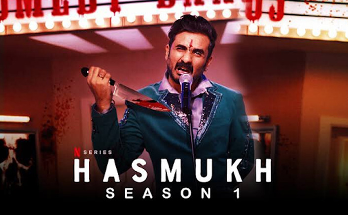
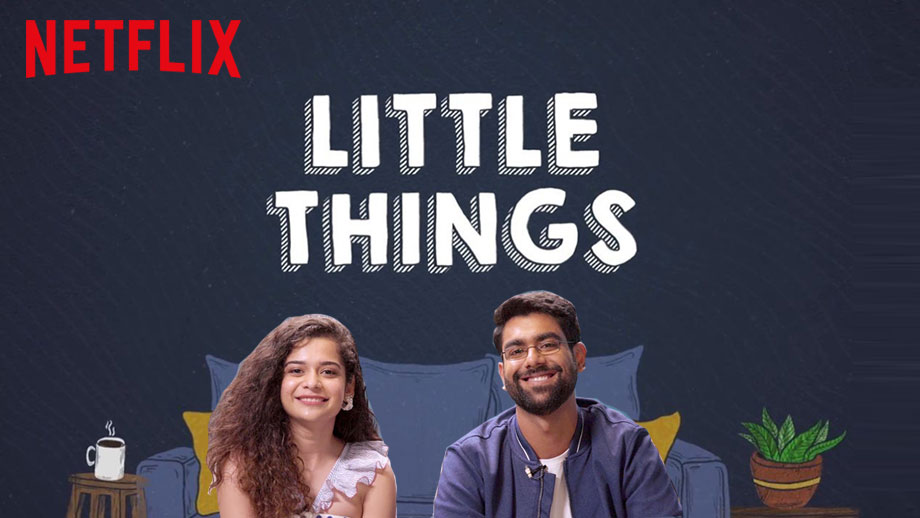
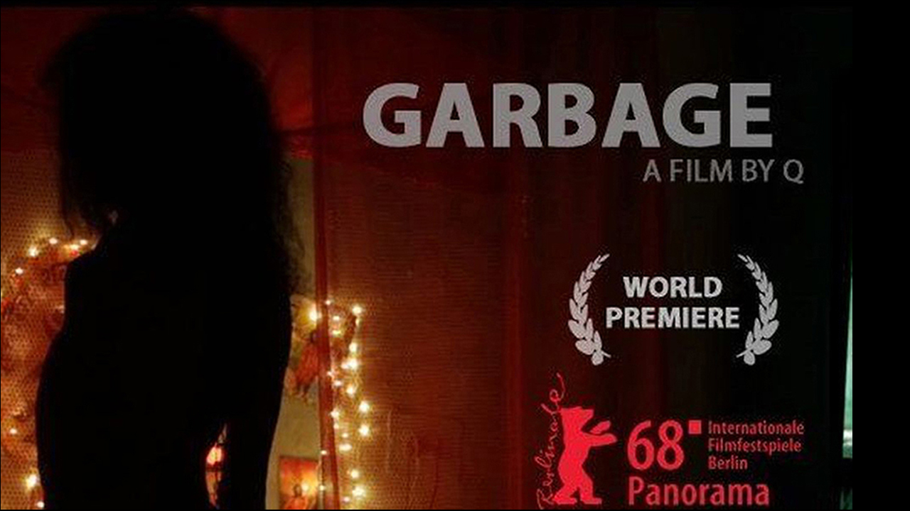
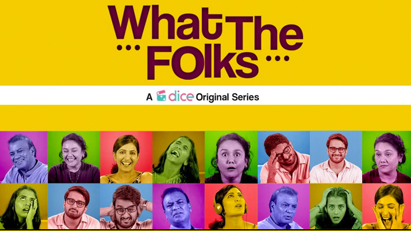
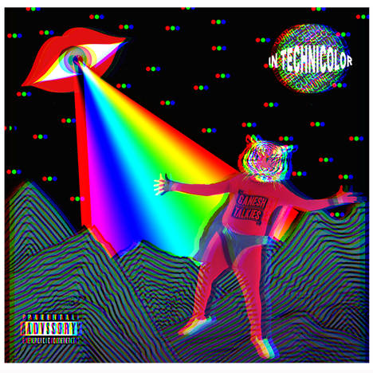

<!-- Main -->

<!-- One -->
<section id="one">
	

		<header class="major">
			<h1>Releases</h1>
		</header>

<!-- Content -->
<!-- <h2 id="content">Sample Content</h2> -->

	

		<h3>Decoherence (2020)</h3>
		
	

	

		<h3>Zaphod's Dilemma (2020)</h3>
		
	

	

		<h3>Trilogy of Five (2019)</h3>
		
	

	

		<h3>Social Isolation I (2020)</h3>
		
	

	

		<h3>Social Isolation II (2020)</h3>
		
	

	

		<h3>Peninsula Volume 1 (2019)</h3>
		
	

<!-- One -->
<section id="two">
	

		<header class="major">
			<h1>Media Composition</h1>
		</header>

<!-- Content -->
<!-- <h2 id="content">Sample Content</h2> -->

	

		<h3>RCB Campaign (2020)</h3>
		
<i>Music Composition and Production</i>

		
	

	

		<h3>Fossils Campaign (2020)</h3>
		
<i>Music Composition and Production</i>

		
	

	

		<h3>Hasmukh (2020)</h3>
		
<i>Music Production, Additional Composition</i>

		
	

	

		<h3>Afsos (2020)</h3>
		
<i>Music Production, Additional Composition</i>

		
	
 
	

		<h3>Little Things Season 3 (2019)</h3>
		
<i>Music Production, Mixing</i>

		
	

	

		<h3>Thinkistan (2019)</h3>
		
<i>Music Production, Mixing</i>

		
	

	

		<h3>Why Cheat India (2019)</h3>
		
<i>Music Production, Mixing</i>

			
	

	

		<h3>Kia and Cosmos (2018)</h3>
		
<i>Music Production, Mixing</i>

		
	

	

		<h3>Little Things Season 2 (2018)</h3>
		
<i>Music Production, Mixing</i>

		
	

	

		<h3>0 K.M. (2018)</h3>
		
<i>Music Production (OST), Mixing</i>

		
	

	

		<h3>Garbage (2018)</h3>
		
<i>Diegetic Music</i>

		
	

	

		<h3>Bose: Dead/Alive (2017)</h3>
		
<i>Music Production</i>

		
	

	

		<h3>Laakhon Mein Ek (2017)</h3>
		
<i>Music Production (OST), Mixing</i>

		
	

	

		<h3>What The Folks (2017)</h3>
		
<i>Music Production (OST), Mixing</i>

		
	

	

		<h3>SBG (2016)</h3>
		
<i>Music Production (OST), Mixing</i>

		
	

<!-- //---ENGINEERING--// -->

<section id="one">
	

		<header class="major">
			<h1>Production & Engineering</h1>
		</header>

	

	<h3>Doktor Gandu: Republic of Gandu</h3>
	
<i>Producer, Mix Engineer</i>

	
	

	

		<h3>Park Street Local EP </h3>
		
<i>Producer, Mix Engineer</i>

		
	

	

		<h3>Ganesh Talkies: GIFS </h3>
		
<i>Recording Engineer</i>

		
	

	

		<h3>Run It's the Kid</h3>
		
<i>Recording Engineer</i>
 
		
	

	

		<h3>The Supersonics: Heads Up</h3>
		
<i>Recording Engineer</i>

		
	

	

		<h3>Ganesh Talkies: In Technicolor</h3>
		
<i>Recording Engineer</i>

		
	

<footer id="footer">
		

			<ul class="icons">
				
				<li><a href="{{ site.twitter_url }}" class="icon alt fa-twitter" target="_blank">Twitter</a></li>
				
				
				<li><a href="{{ site.googleplus_url }}" class="icon alt fa-google-plus" target="_blank">Google+</a></li>
				
				
				<li><a href="{{ site.facebook_url }}" class="icon alt fa-facebook" target="_blank">Facebook</a></li>
				
				
				<li><a href="{{ site.instagram_url }}" class="icon alt fa-instagram" target="_blank">Instagram</a></li>
				
				
				<li><a href="{{ site.pinterest_url }}" class="icon alt fa-pinterest" target="_blank">Pinterest</a></li>
				
				
				<li><a href="{{ site.gitlab_url }}" class="icon alt fa-gitlab" target="_blank">GitLab</a></li>
				
				
				<li><a href="{{ site.github_url }}" class="icon alt fa-github" target="_blank">GitHub</a></li>
				
				
				<li><a href="{{ site.slack_url }}" class="icon alt fa-slack" target="_blank">Slack</a></li>
				
				
				<li><a href="{{ site.linkedin_url }}" class="icon alt fa-linkedin" target="_blank">LinkedIn</a></li>
				
			</ul>
			<ul class="copyright">
				<li>&copy; {{ site.title }} {{ site.subtitle }}</li>

			</ul>
		

	</footer>

